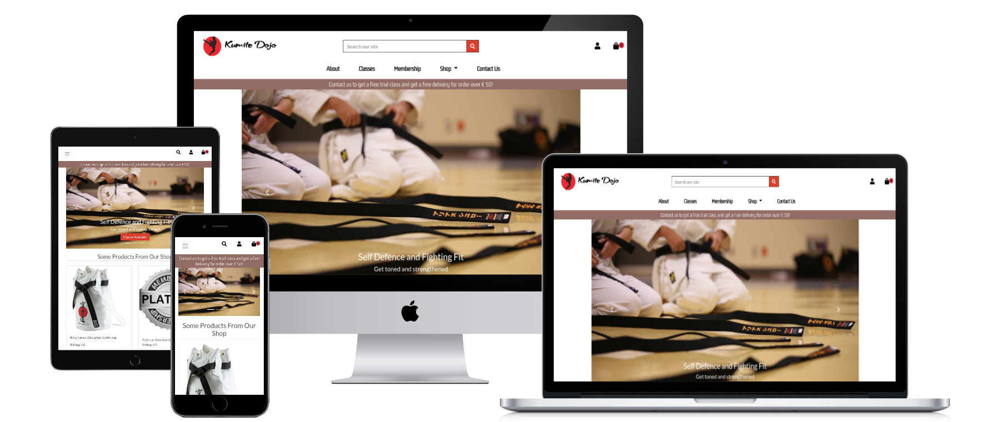
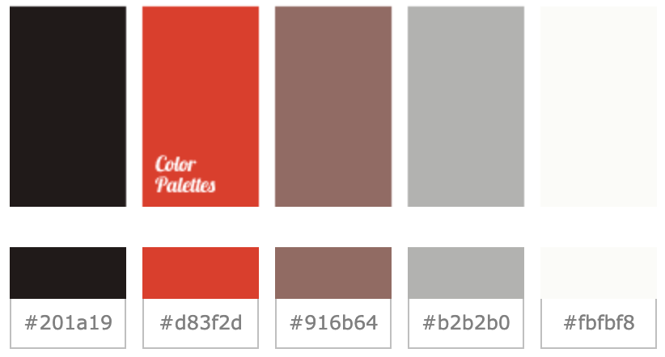
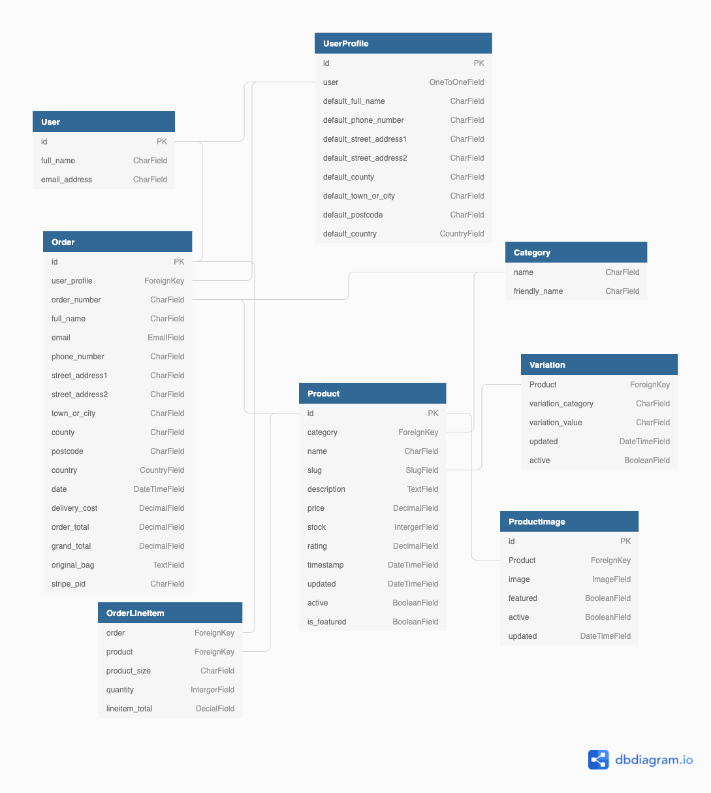

# Kumite Dojo

Karate practice strengthens the mind, it teaches "Mentality over technique".

Having tried shotokan karate myself, I can say that it is a fantasic sport! It not only strengthens your body but also your mind and spirit.

My Sensei Seamus O'Dowd is a 6th Dan black belt. He has been teaching Karate for over two decades. His students are all over the world. Since 2018, he decided to give up his job and teach Karate full time in his Dojo in Stamullen Co.Meath.

This website is a mockup site designed for Sensei Seamus's Dojo.



## [Live site](CI-MS4-kumite-dojo.heroku.com)

## [Contents](#contents)

[UX](#ux)

- [User stories](#user-stories)

- [Design](#design)

- [Wireframes](#wireframes)

[Database Model](#database-model)

[Features](#features)

- [Existing Features](#existing-features)

- [Features Left to Implement](#features-left-to-implement)

[Technoloies Used](#technologies-used)

[Deployment](#deployment)

[Testing](#testing)

[Credits](#credits)

## **UX**

### **Overview**

As an user/potential learner, there are a few things they would like to find out. For example, the history of the dojo, about the instructors, what kind of martial arts classes does the dojo provide. And the class timetable.

### **User stories**

#### **Overall user expectations**

- Easy to navigate

- Consistency

- Intutitive

- Responsive

- Secure

- Visually pleasing

|As a...  |I want to... |So I can... |
|-----|---|---|
| Potential Student  | Immediately understand the purpose of the site | Decide whether to stay or leave  |
|   |  Know the background of the Dojo | So I have a brief idea about the dojo  |
|   | Find out who the instructor is | Decide if I want to train with him/her |
|   | Find out what kind of classes are avaliable  |  Understand what kind of martial arts are taught here |
|   | Find out the class schedule | See if the timetable matches mine  |
|   |Easily browse through the cost of membership  | Learn how much it cost and decide whether to join |
|   | Browse through the shop  | Purchase products  |
|   | Add items to my shopping bag before registering |  Avoiding registering if not neccessary |
|   | Search classes and products by name  |  Find specific class or products |
|   | Choose clothes and belts size   | Customise purchases to my preference  |
|   | Contact the dojo for more informations | Make further decision          |
| Registered User  |  Save my default delivery details | Proceed to checkout more quickly in the future   |
|   | View my previous purchases  | Make repeat order  |
|   | Review my shopping bag prior to checkout  | Remove/Adjust quantities  |
|   | Recieve confirmation of my orders  | Have proof of purchase  |
|   | Recieve free delivery above an order threshold  |  Feel rewarded for larger purchases |
| Site Owner  | View, add, edit and delete products  | Keep the product list up to date  |
|   |  Have a simple payment system | Easily make changes for all products  |

### **Design**

#### **Color Scheme**

The main color scheme of this project is grey, white, black and red as it is Shotokan Karate logo's main color scheme. The following is the color pallatte:



#### **Hero Images**

The hero images slides I have chose to use in the home page is mainly black and white with a soft tone to it. So it goes well with the overall color scheme.

#### **Fonts**

[Lato](https://fonts.google.com/specimen/Lato?query=lato#about) - Lato is a sans serif typeface family it gives the website a soft generic feel.

[Gemunu Libre](https://fonts.google.com/specimen/Gemunu+Libre?query=Gemunu+Libre#about) - I chose this font for the navbar as it gives the feeling of old and traditional.

[Grechen Fuemen](https://fonts.google.com/specimen/Grechen+Fuemen?query=Grechen+Fuemen#about) - I used this font for the main logo because I think it looks a little bit like Japanese writing.

### **Wireframes**

Wireframes created at the start of the project for mobile and desktop can be accessed [here.](wireframes/wireframe.md)

There were some deviations from the plan due to time constraints. There were:

- Not including a product review system.

- Not including a wishlist due to the complexity of implementing Ajax.

- Not including a pagination .

[Back to contents](#contents) ⬆️

## **Database Model**

A relational database is best suited to this project given the number of relationships between the models. SQLite was used during development and Heroku Postgres in production. The diagram below may help visualise the database and relationships between each model.



### **Key Models**

#### **UserProfile**

- Created on registration for each user, holds user information that can be used to speech checkout process.

- Stores order history for previous orders to encourage repeat order.

#### **Product**

- Holds the infomation about a product includes name, description, price, stock counts and rating.

- The foreign key to ProductImage is very important as it allows multiple images attach to this particular product.

- Similar to ProductImages, the variation foreign key relationship between Product and Variation is crutial. As it gives different product its individual unique sizes and colors.

- The relationship to Category is descriptive.

#### **ProductImage**

- This models stores multiple images for each product. Which is ideal in real life scenario, a product is more than likely has more than one image attach to it. Also gives the user a better user experience.

#### **Variation**

- This model allows us to give each product a different variation regardless the category/value. In my case, I was able to give the products different colors and sizes.

#### **Category**

- This model divide the products into category according to its types.

- Considering the chances of blank spaces we also give it a friendly name.

#### **Order**

- Stores information about an order such as user, order number, delivery details and total cost.

#### **OrderLineItem**

- This models stores each product in each order by its name, size, quantity and a subtotal.

#### **Bag**

- A bag has been create each time a lineitem has been added to the bag along with a bag id,and deleted after each checkout.

#### **BagItem**

- This model has a foriegnkey relation to product model, and many to mang relation with the variation model.

#### **Banner**

- This model generates the home page hero images slides.

#### **Contact**

- This model sends the users' name, email and messages into admin.

[Back to contents](#contents) ⬆️

## **Features**

### **Existing Features**

#### **Across the Site**

- **Navbar** - consistent on all pages and provides quick access to all areas of the site.

- **Search Bar** - allows the user to search a particular product with a key word.

- **Toasts** - Bootstrap toasts gives interaction to users after each action carried out. Show the shopping bag view for quick checkout option. Avoid confusion and gives user a better experience.

- **Responsive** - Bootstrap
s grid system and various media queries had been used throughout the project to ensure responsiveness.

- **User Profile** - allow users to save their information for easy acess for next visit. Order history encourage repeat order.

- **Bag Item Counts** - the number of items in the shopping bag tells uers how many items they have added to the bag.

- **Navbar Banner** - tells the user about free class and free delivery offer.

- **Footer** - tells the user about the site purpose and developer info.

#### **Page Specific**

#### ***Home***

- Hero image slides gives potential customers a brief idea what the dojo providing.

- The quick links gives the users a quick access to specific area of the site.

- The featured products section draw user's attention there is a shop in the site, encourage potential purchases.

#### ***Products***

- Product cards show the essential details of the product(name, rating, price and category)

- View Prouct details button tells the user, there's more to explore.

- Bootstrap Breadcrumb indicates which page the user is on and how many products are avaliable on the page.

- The filtering bar allows the users to sort the products by specific query.

- Back to top button allows the users to go back to the top at any time.

#### ***Product Detail***

- In addtion of the information the products page gives to the user, the product detail page gives the user a brief discription about the product.

- There are also more images displayed if there are any.

- The user then has an option of choosing a color or size for that specific product if it applies.

- Two buttons provided at the bottom to add to bag or keep shopping.

#### ***Bag***

- Allows line item quantities to be altered or removed from the bag and updates on each change.

- Shows bag total, delivery, and grand total of the order.

- Provide link to the specific product, allow easy alteration to sizes and colors etc.

- If bag total is less than free delivery threshold, amount required to receive free delivery is shown.

#### ***Checkout***

- Shows order summary and form to input delivery details.

- Payment handled by Stripe and reliability improved by use of webhooks.

    *Registered users*

- If delivery details previously saved, form will be pre-populated with them.

- Option to save delivery details for future purchases.

#### ***Checkout Success***

- Shows a summary of the order identifier, contact info and delivery information provided, as well as details of the order itself. On checkout the user is sent a confirmation email with details about their order.

- A quick link to go back to the shop.

#### ***My Profile***

#### *Registered User*

- Default contact and deliver info

- Ability to update to make future checkouts quicker

- view previous orders using same template as checkout success page

#### ***Add/Edit Product***

#### *Super users*

- Can add/edit a product, chosing all of its required features.

- Can choose whether or not the product shows on home page  featured product section.

- On submitting the addition/change, super user is sent to the updated product detail page.

#### **Secure Accounts**

Account security is covered by Django's allauth.

#### **CRUD functionality**

*All users:*

- Read all products

*Registered users:*

- Update their delivery details

*Super users:*

- Create, update and delete any products

#### **Static and image file hosting**

Static and image files are served from an Amazon S3 Bucket.

#### **Confirm delete**

When users request to delete an orderline product from their shopping bag or a superuser request to delete an product, an alert pops up to confirm if they wish to do so to prevent accidental deletion.

#### **Access protection**

Routes are protected using Django's @login_required route decorators to ensure non-super-users cannot interfere with the database.

404 and 500 error handling Pages for 404 and 500 errors keep the user on the site when something goes wrong, allowing them to return to the content with minimal disruption.

### **Features Left to Implement**

- Blog app to display industry and Kumite Dojo news, including comments feature to engage with the communit and gather more feedback.

- Wishlisht for users to save their favourite products.

- Products reviews, so the users can come back and leave a review after their purchase.

- "Learning App" to show karate techniques and videos etc.

[Back to contents](#contents) ⬆️

## **Technologies Used**

### **Languages**

- [HTML](https://developer.mozilla.org/en-US/docs/Web/HTML)

- [CSS](https://developer.mozilla.org/en-US/docs/Web/CSS)

- [Python](https://www.python.org/)

- [Javascript](https://developer.mozilla.org/en-US/docs/Web/JavaScript)

### **Frameworks**

- [Bootstrap 4.4](https://getbootstrap.com/docs/4.4/getting-started/introduction/)

- [Django](https://www.djangoproject.com/)

- [jQuery](https://jquery.com/)

### **Database**

- [sqlite3](https://www.sqlite.org/index.html)

- [Heroku Postgres](https://www.heroku.com/postgres)

### **Extensions and kits**

- [Boto3](https://boto3.amazonaws.com/v1/documentation/api/latest/index.html)

- [Pillow](https://pillow.readthedocs.io/en/stable/)

- [stripe](https://stripe.com/docs)

### **Project Management**

- [Amazon AWS](https://aws.amazon.com/?nc2=h_lg) (S3, IAM)

- [Github](https://github.com/)

- [Heroku](https://heroku.com)

### **Tools**

- [Am I Responsive](http://ami.responsivedesign.is/)

- [Balsamiq](https://balsamiq.com/wireframes/)

- [DB Diagram](https://dbdiagram.io/home)

- [Font Awesome](https://fontawesome.com/)

- [Google Font](https://fonts.google.com/)

[Back to contents](#contents) ⬆️

## **Deployment**

### **Requirements**

[Python 3](https://www.python.org/downloads/) - core code

[pipenv](https://pypi.org/project/pipenv/) - package installation and python environment control

[Git](https://git-scm.com/) - version control

[Amazon AWS S3 Bucket](https://aws.amazon.com/) - host the site's static and media files

**Values for the env.py environment variables and Heroku Config Vars used in the sections below will be unique to each sqlight, Postgres and S3 Bucket created. Please refer to their respective documentation for further details.**

<details>
<summary>How to clone Kumite Dojo and run locally</summary>
<br>

To clone this project from its [GitHub repository](https://github.com/MelindaZhang2020/CI-MS4-kumite-dojo):

1.From the repository, click **Code**

2.Go to the Clone >> HTTPS section, copy the clone URL for the repository

3.Go to your local IDE open your CLI

4.Change the current working directory to the location where you want the cloned directory to be made

5.Type `git clone`, and then paste the URL you copied in Step 2

```
git clone https://github.com/MelindaZhang2020/CI-MS4-kumite-dojo.git
```

6.Press Enter. Your local clone will be created

7.Create a file called env.py to hold your app's environment variables, which should contain the following:

```
import os
os.environ["SECRET_KEY"] = "app secret key of your choice"
os.environ["STRIPE_PUBLIC_KEY"] = "stripe public key generated by stripe"
os.environ["STRIPE_SECRET_KEY"] = "Stripe secret key generated by stripe"
os.environ["STRIPE_WH_SECRET"] = "webhook secret key generated by stripe"
os.environ["DEVELOPMENT"] = "True"
```

To find your Stripe keys, login to Stripe and then under the **Developers** tab look for the 'Publishable Key' and 'Secret Key'

The webhook secret key can be found under Webhooks once you have created an endpoint, which should be set to receive all events and match this url structure:

```
<your site's base url>/checkout/wh/
```

You will need a different endpoint for the local version and deployed site, updating the STRIPE_WH_SECRET accordingly in their respective environment variables.

8.Make sure the following are listed in your .gitignore file to prevent any environment variables being pushed publicly:

```
env.py
__pycache__/
*.sqlite3
*.pyc
```
9.Create and activate virtual environment using:
```
pipenv shell
```

10.Install all the app requirements using:

```
pip install requirements.txt
```

11.Apply database migrations using:

```
python manage.py migrate
```
12.Create a new superuser and fill in your own details using:

```
python manage.py createsuperuser
```

13.The app can now be running loacally using:
```
python manage.py runserver
```
</details>
<details>
<summary>How to deploy to Heroku</summary>
<br>

1.Log In to Heroku

2.Select **Create new app** from the dropdown in the Heroku dashboard

3.Choose a unique name('Kumite-dojo') for the app and the location nearest to you

4.Under **Resources** search and add **Heroku Postgres** database to your app and choose the free plan

5.Go to your CLI install **dj_database_url** and **psycopg2** so that you can sue Postges on your deployed site, commands are:
```
pipenv install dj_database_url
pipenv install Psycopg2-binary
```

6.Add those packages to requirements.txt using:
```
pip freeze > requirements.txt
```

7.Go to settings.py, setup the new database using code below:
```
import dj_database_url
```
```
if "DATABASE_URL" in os.environ:
    DATABASES = {"default": dj_database_url.parse(os.environ.get("DATABASE_URL"))}
else:
    DATABASES = {
        "default": {
            "ENGINE": "django.db.backends.sqlite3",
            "NAME": BASE_DIR / "db.sqlite3",
        }
    }
```

9.Set debug using:
```
DEBUG = "DEVELOPMENT" in os.environ
```

10.Get database url from heroku settings > config vars or using:
```
heroku config
```

11.Set `DATABASE_URL` in env.py

12.Log into heroku via Heroku CLI using:
```
heroku login -i
```

13.Migrate the database into Postgres using:
```
python manage.py migrate
```

14.Import all product data using the fixtures created during development

15.Create a new superuser and fill in your own details using:
```
python manage.py createsuperuser
```

16.Install gunicorn
```
pipenv install gunicorn
```

17.Add the package into requirements
```
pip freeze > requirements.txt
```

18.Create a file call **Procfile** and include the following, making sure not to leave a blank line after it:
```
web:gunicorn kumite_dojo.wsgi:application
```

19.Disable Heroku's static file collection(temporarily)
```
heroku config:set DISABLE_COLLECTSTATIC=1 --app kumite-dojo
```

20.Add the hostname of your heroku app to settings.py
```
ALLOWED_HOSTS = ["kumite-dojo.herokuapp.com", "localhost"]
```

21.Commit all changeds to github

22.Go to the **Settings** tab and under **Config Vars** choose **Reveal Config Vars** and set Django secret key where you can find in your env.py as **SECRET_KEY**

23.Initial heroku git remote using:
```
heroku git:remote -a kumite-dojo
```

24.Deploy to Heroku using:
```
git push heroku main
```

25.Your deployed site can be launched by clicking **Open App** from its page within Heroku.

26.Back in Heroku, select the **Deploy** tab and under **Deployment method** choose GitHub

27.Go to **Connect to GitHub** enter your GitHub repository details and once found, click **Connect**, under **Automatic deploys** choose **Enable Automatic Deploys**
</details>

<details>
<summary>Setting up an S3 Bucket (Amazon Simple Storage Service)</summary>
<br>

1.Create an [Amazon AWS](https://aws.amazon.com/?nc2=h_lg) account

2.Search for **S3** and create a new bucket name it the same as your Heroku app(kumite-dojo)

- uncheck block all public access box

- check "I acknowledge that the current settings might result in this bucket and the objects within becoming public."

3.Under **Properties > Static**website hosting

- enable

- index.html as Index document

- error.html as Error document

- save

4.Under **Permissions > CORS** use:

```
[
  {
      "AllowedHeaders": [
          "Authorization"
      ],
      "AllowedMethods": [
          "GET"
      ],
      "AllowedOrigins": [
          "*"
      ],
      "ExposeHeaders": []
  }
]
```

5.Under **Permissions > Bucket** Policy:

- Generate Bucket Policy and take note of **Bucket ARN**

- Chose **S3 Bucket Policy** as Type of Policy

- For **Principal**, enter *

- Actions **Get Object** and **Put Object**

- Enter **ARN** noted above

- **Add statement**

- **Generate policy**

- Copy the **policy JSON Document** paste into **Edit bucket policy**

- Add a /* onto the end of the **resource key**

- Save changes

6.Under **Access Control List (ACL)**:

- For **Everyone (public access)**, tick **List**

- Accept that everyone in the world may access the Bucket

- Save changes

</details>

<details>

<summary>Setting up AWS IAM (Identity and Access Management)</summary>

<br>

1.From the **IAM dashboard** within **AWS**, select User Groups:

- Create new group e.g. manage-kumite-dojo

- Click through without adding a policy

- **Create Group**

2.Select **Policies**:

- Create policy

- Under **JSON** tab, click **Import managed policy**

- Choose **AmazongS3FullAccess**

- Edit the resource to include the Bucket ARN noted earlier when creating the Bucket Policy:

```
                "Resource": [
			                "arn:aws:s3:::kumite-dojo",
			                "arn:aws:s3:::kumite-dojo/*"
                ]
```

- Click **next step** and go to **Review policy**

- Give the policy a name e.g. kumite-dojo-policy and description

- **Create Policy**

3.Go back to **User Groups** and choose the group created earlier

- Under **Permissions > Add permissions**, choose **Attach Policies** and select the one just created

- **Add Permissions**

4.Under **Users:**

- Choose a user name e.g. kumite-dojo-staticfiles-user

- Select **Programmatic access** as the **Access type**

- Click Next

- Add the user to the Group just created

- Click Next and **Create User**

5.**Download the .csv containing the access key and secret access key. This will NOT be available to download again**

</details>

<details>

<summary>Connecting Django to S3</summary>

<br>

1.Install boto3 and django-storages

```
pipenv install boto3
pipenv install django-storages
pip freeze > requirements.txt
```

2.Add 'storages' to settings.py ` INSTALLED_APPS`

3.Go to settings.py set the bucket config, 

```
if "USE_AWS" in os.environ:
    # Bucket Config
    AWS_STORAGE_BUCKET_NAME = "kumite-dojo"
    AWS_S3_REGION_NAME = "eu-west-1"
    AWS_ACCESS_KEY_ID = os.environ.get("AWS_ACCESS_KEY_ID")
    AWS_SECRET_ACCESS_KEY = os.environ.get("AWS_SECRET_ACCESS_KEY")
    AWS_S3_CUSTOM_DOMAIN = f"{AWS_STORAGE_BUCKET_NAME}.s3.amazonaws.com"

```

2.Add the values from the **.csv** you downloaded to your Heroku Cvars under Settings:

```
AWS_ACCESS_KEY_ID
AWS_SECRET_ACCESS_KEY
USE_AWS=True
```
3.Delete the `DISABLE_COLLECTSTATIC` variable from your Cvars and deploy your Heroku app

4. Create custom_storage.py with code below:

```
from django.conf import settings
from storages.backends.s3boto3 import S3Boto3Storage


class StaticStorage(S3Boto3Storage):
    location = settings.STATICFILES_LOCATION


class MediaStorage(S3Boto3Storage):
    location = settings.MEDIAFILES_LOCATION
```

5.Go to settings.py, set the static and media files storage and location and override static and media urls in production:

```
# Static and media files
STATICFILES_STORAGE = "custom_storages.StaticStorage"
STATICFILES_LOCATION = "static"
DEFAULT_FILE_STORAGE = "custom_storages.MediaStorage"
MEDIAFILES_LOCATION = "media"

# Override static and media URLs in production
STATIC_URL = f"https://{AWS_S3_CUSTOM_DOMAIN}/{STATICFILES_LOCATION}/"
MEDIA_URL = f"https://{AWS_S3_CUSTOM_DOMAIN}/{MEDIAFILES_LOCATION}/"
```

4.With your S3 bucket now set up, you can create a new folder called media (at the same level as the newly added static folder) and upload any required media files to it, making sure they are publicly accessible under **Permissions**

5.Add stripe keys in config vars in heroku, make sure the name match settings.py

6.Add stripe webhook endpoint with the deployed site url:

```
https://kumite-dojo.herokuapp.com/checkout/wh/

```
7.Get the new `STRIPE_WH_SECRET` and added it to the config vars.

8.Now your site is fully deployed at [https://kumite-dojo.herokuapp.com](https://kumite-dojo.herokuapp.com)

</details>

[Back to contents](#contents) ⬆️

## **Testing**

Full details of testing can be found [here.](testing.md)

[Back to contents](#contents) ⬆️

## **Credits**

### **Resources and Tutorials**

- [Django Docs](https://docs.djangoproject.com/en/3.2/)

- [Code Institute Boutique Ado walk through](https://learn.codeinstitute.net/courses/course-v1:CodeInstitute+FSF_102+Q1_2020/courseware/4201818c00aa4ba3a0dae243725f6e32/d3188bf68530497aa5fba55d07a9d7d7/)

- [Coding Point - Django Tutorial for beginners](https://www.youtube.com/playlist?list=PLPp4GCMxKSjCM9AvhmF9OHyyaJsN8rsZK) - create "ProductImage" model and attach multiple images to single product.

- [Django Ecommerce | Build Advanced Django Web Application](https://www.udemy.com/course/django-ecommerce-project-based-course-python-django-web-development/) - learned create variation model and variation manager from this course

### **Code modified from other sources**

- [How to Customize Django Admin](https://www.youtube.com/watch?v=yEJH6sZFsAY&list=PLgnySyq8qZmrxJvJbZC1eb7PD4bu0a-sB&index=7&t=252s) - Banners and featured products

- [Upload Multiple Images to a Django Model without plugins](https://soshace.com/upload-multiple-images-to-a-django-model-without-plugins/) - upload multiple images in django admin product model

- [Add a Custom Favicon to your Django Web App](https://www.ordinarycoders.com/blog/article/add-a-custom-favicon-to-your-django-web-app) - add favicon to the site

### **Content**

- [Martial Arts Inc](https://martialartsinc.com/) - used this site as an inspiration

- [Blitzsports.com](https://www.blitzsport.com/) - all products images and descriptions

### **Media**

- [pixabay](https://pixabay.com/) - logo and hero images

### **Acknowledgements**

I would like to thank:

- My mentor Antonio Rodriguez for his patience and generosity with his times.

- Help and support from fellow students in the Slack community.

- Tutor support and student care team.

### **Disclaimer**

This site was developed for educational purposes only.

[Back to contents](#contents) ⬆️
