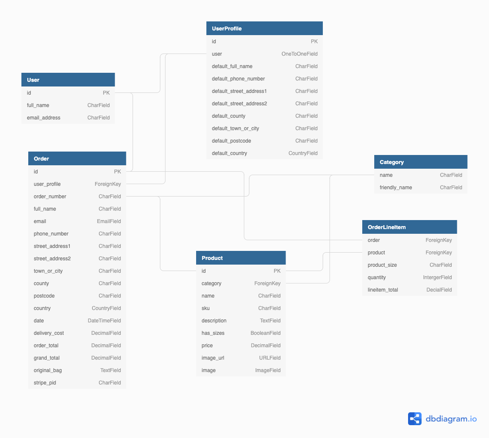

# Kumite Dojo

Karate practice strengthens the mind, it teaches "Mentality over technique".

Having tried shotokan karate myself, I can say that it is a fantasic sport! It not only strengthens your body but also your mind and spirit.

My Sensei Seamus O'Dowd is a 6th Dan black belt. He has been teaching Karate for over two decades. His students are all over the world. Since 2018, he decided to give up his job and teach Karate full time in his Dojo in Stamullen Co.Meath.

This website is a mockup site designed for Sensei Seamus's Dojo.

## [Live site](CI-MS4-kumite-dojo.heroku.com)

## [Contents](#contents)

[UX](#ux)

- [User stories](#user-stories)

- [Design](#design)

- [Wireframes](#wireframes)

[Database Model](#database-model)

[Features](#features)

- [Existing Features](#existing-features)

- [Features Left to Implement](#features-left-to-implement)

[Technoloies Used](#technologies-used)

[Testing](#testing)

[Deployment](#deployment)

[Credits](#credits)

## **UX**

### **User stories**

|As a...  |I want to... |So I can... |
|-----|---|---|
| Potential Student  | Immediately understand the purpose of the site | Decide whether to stay or leave  |
|   |  Know the background of the Dojo | So I have a brief idea about the dojo  |
|   | Find out who the instructor is | Decide if I want to train with him/her |
|   | Find out what kind of classes are avaliable  |  Understand what kind of martial arts are taught here |
|   | Find out the class schedule | See if the timetable matches mine  |
|   |Easily browse through the cost of membership  | Learn how much it cost and decide whether to join |
|   | Browse through the shop  | Purchase products  |
|   | Add items to my shopping bag before registering |  Avoiding registering if not neccessary |
|   | Search classes and products by name  |  Find specific class or products |
|   | Choose clothes and belts size   | Customise purchases to my preference  |
| Registered User  |  Save my default delivery details | Proceed to checkout more quickly in the future   |
|   | View my previous purchases  | Make repeat order  |
|   | Review my shopping bag prior to checkout  | Remove/Adjust quantities  |
|   | Recieve confirmation of my orders  | Have proof of purchase  |
|   | Recieve free delivery above an order threshold  |  Feel rewarded for larger purchases |
| Site Owner  | View, add, edit and delete products  | Keep the product list up to date  |
|   |  Have a simple payment system | Easily make changes for all products  |

### **Design**

### **Wireframes**

Wireframes created at the start of the project for mobile and desktop can be accessed [here.](wireframes/wireframe.md)

[Back to contents](#contents) ⬆️

## **Database Model**

A relational database is best suited to this project given the number of relationships between the models. SQLite was used during development and Heroku Postgres in production. The diagram below may help visualise the database and relationships between each model.

### **Key Models**

#### **UserProfile**

- Created on registration for each user, holds user information that can be used to speech checkout process.

- Stores order history for previous orders to encourage repeat order.

#### **Order**

- Stores information about an order such as user, order number, delivery details and total cost.

#### **Product**

- Holds the infomation about a product includes name, sku, description, price and image.

- The relationship to Category is merely descriptive.

#### **Category**

- This model divide the products into category according to its types.

- Considering the chances of blank spaces we also give it a friendly name.

#### **OrderLineItem**

- This models stores each product in each order by its name, size, quantity and a subtotal.

[Back to contents](#contents) ⬆️

## **Features**

### **Existing Features**

### **Features Left to Implement**

[Back to contents](#contents) ⬆️

## **Technologies Used**

### **Languages**

### **Frameworks**

### **Database**

### **Extensions and kits**

### **Project Management**

### **Tools**

[Back to contents](#contents) ⬆️

## **Testing**

[Back to contents](#contents) ⬆️

## **Deployment**

- How to clone Kumite Dojo and run locally

- How to deploy to Heroku

- Setting up an S3 Bucket (Amazon Simple Storage Service)

- Setting up AWS IAM (Identity and Access Management)

- Connecting Django to S3

[Back to contents](#contents) ⬆️

## **Credits**

### **Resources and Tutorials**

### **Code modified from other sources**

### **Content**

### **Media**

### **Acknowledgements**

### **Disclaimer**

This site was developed for educational purposes only.

[Back to contents](#contents) ⬆️
