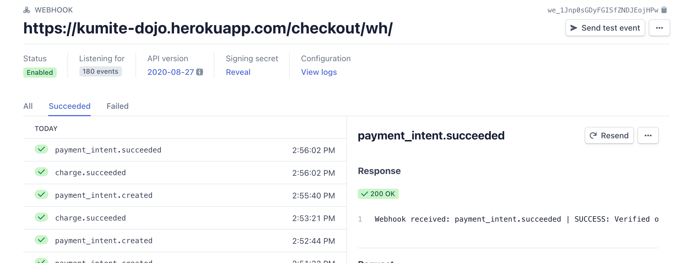
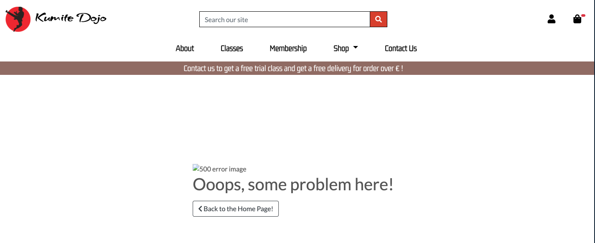

Back to [README](README.md)

# **Testing**

## **[Contents](#contents)**

[User Stories](#user-stories)

[Validator](#validator)

[Lighthouse](#lighthouse)

[Manual Testing](#manual-testing)

[Responsiveness Testing](#responsiveness-testing)

[Resolved Issues](#resolved-issues)

[Unresolved Issues](#unresolved-issues)

## **User Stories**

### **Overall user expectations**

#### **Easy navigation**

- Heading descriptive of the content displayed.

- Navar clearly indicate page directions.

- Logo direct user back to home page.

- Easy access to user profile and shopping bag.

- Options of sort product by price, rating, name or category.

- Back to top button when the list get too long.

- Keep shopping buttons throughout checkout process.

#### **Consistency**

- Consistent visual effect throughout the whole site.

- Same navbar and footer navigation system across all pages.

- Images and elements are well contained throughtout the site.

#### **Intuitive**

- Familiar icons have been used across the site for commonly expected actions e.g.shopping bag, delete, user and search.

- Toasts pop-ups alert the user when they perform actions i.e. login, errors, sucess etc.

- Modal appears to confirm content deletion.

#### **Responsiveness**

- Pages adapt a variety of screen sizes and extensive testing in Chrome Dev Tools.

- Page structure has been modified for mobile screen size to ensure readability.

#### **Secure**

- Allauth provides a robust user account system while Stripe offers secure payments, furthered by use of webhooks to ensure transactions are recorded.

#### **Appealing Visuals**

- Simple black and white color dazzled with a bit of red, gives the user the feel of ancient Japanese Karate.

- Simple fonts ensure readability and bring content together.

### **As a potential Student I want to ...**

**Immediately understand the purpose of the site and what it can provide**

- The logo and name immediately spell out the purpose and the tone of the site, it's a Karate club.

- The hero images slides with its headlines and links further demonstrate what the club has to offer.

- The banner under the navbar tells the user there are classes and delivery involed, therefore there must be a shop.

- As the user scrolling down, it confirms that there is a shop by seeing the featured products section.

**Know the background of the dojo, and who the instrucor is**

- As the user keep browsing, they can see the about section, there are informations about the dojo and instructors.

**Findout what kind classes are avaliable and class schedule**

- The classes page contains classes and timetable information and a brife description of the classes.

**Easily Browse through the cost of membership**

- The membership page leads the user to a description about the membership and its costs.

**Browse through the shop**

- The navbar clearly marked out the shop section, and the choice of browse it by category.

**Add items to my shopping bag before registering**

- The user can add items to the shopping bag without register.

**Search classes products by name**

- The searchbar provides the user search certain products by name from the shop.

- Unfortunately the user can't search a class by it name yet, but this functionality can be developed in the future.

**Choose clothes and belts size**

- The user can choose clothes and belt by various sizes and colors.

**Contact the dojo for more informations**

- This need has been satisfied by providing a contact form to the user, and the data will be sent to the admin page, so that the site owner can contact the user to provide further information.

### **As a registered user, I want to ...**

**Save my default delivery details**

- As soon as a user checkout, if he/her tick save info box, his/her personal info will be saved into database.

**View my previous purchases**

- This also will be saved as long as the user clicked save info, and the user can click on the order number to be redirect to the checkout success page.

**Review my shopping bag prior to checkout**

- The shopping bag can be grabbed at ease, and also previewed when the user add or delete an item from the shopping bag.

**Recieve confirmation of my orders**

- An real email will be sent as soon as the order is gone throught to confirm the details of the order, delivery info and grand total.

**Recieve free delivery above an order threshold**

- This is offered and clearly stated during checkout, and encourage the user to get free delivery once they spend over 50.

### **As a site owner, I want to ...**

**View, add, edit and delete products**

- The site owner can access a quick add page through frontend page.

- And this functionality is cover with Django admin interface, and beyond... 

- The site owner can not only add, edit and delete produts, but also control inventory, add multiple images, add different sizes and colors to different products.

- The site owner can also choose to active/deactive an product, add a specific product into featured products section on home page.

- The site owner can also change hero images and taglines to offer more classes and opportunities.

**Have a simple payment system**

- The stripe payment system is simple to use and reliable.

[Back to contents](#contents) ⬆️

## **Validator**

[W3C-HTML](https://validator.w3.org/)

- Error Duplicate ID due to double navbar for desktop view and mobile view - modified ✅

[W3C-CSS](https://jigsaw.w3.org/)

- Value Error : padding-bottom Too many values or values are not recognized : [ footer-height ] 

    Error caused by making footer stays at the bottom of the page, therefore it works fine - ignored

[Unicorn revealer - overflow](https://chrome.google.com/webstore/detail/unicorn-revealer/lmlkphhdlngaicolpmaakfmhplagoaln?hl=en-GB) - no evidence of overflow **Pass** ✅ 

[JS Hint](https://jshint.com/) - no error, no warning **Pass** ✅ 

[Pep8 Online](http://pep8online.com/) - all `.py` files have been paste into pep8 onlie, 0 errors - **Pass** ✅ apart from:

- webhookhandler.py has two lines which could not be shortened without making the code illegible

- webhooks.py has one line which could not be shortened

- settings.py has two lines which could not be shortened

## **Light House** - Chrome DevTools

During testing, I used Chrome DevTools lighthouse reports. I have generated a report for each page both desktop and mobile. There were a list of actions have been taken to improve the score regarding SEO and Performance see below:

- Resize all images, and use webp format for two of the big size hero images.

- Add meta data descriptions 

- Add apple touch icon

[Back to contents](#contents) ⬆️

## **Manual Testing**

### **Navigation**

| **Element** | **Action**|  **Expected Result** |  **Pass/Fail** |
|---|---|---|---|
|  **Navbar** |   |   |   |
|  Logo/Site name | click  | redirect to home page  |  Pass |
|  Searchbar |  Enter a query | display products related to that query  |  Pass |
|  Searchbar Icon| click | submit query | Pass |
|  My Accout Icon dropdown | click  |  display a dropdow list |  Pass |
|  Register |  click |  redirect to sign up page | Pass   |
| Log in  |  click | redirect to sign in page    | Pass   |
| My Profile |  click |  redirect to my profile page | Pass   |
|   |   | (only when user are logged in)  | Pass  |
| Log out  | click  | Confirm log out page  | Pass  |
|   |   | (only when user are logged in)  | Pass  |
| Product Admin  | click   |  redirect to add product page | Pass  |
|   |   | (only when superuser are logged in)  | Pass  |
| Bag Icon  | click  | redirect to bag page  | Pass  |
| **MainNav**  |   |   |   |
| About |  click | redirect to about page   | Pass   |
| Classes  | click  | redirect to Classes page  | Pass   |
| Membership  | click   | display memebership category out of products  | Pass  |
| Shop dropdown |  click | display a dropdown list   |  Pass |
| All products  | click   | redirect to all products page  | Pass |
| By Price  | click  | display products by price in ascending order |  Pass |
| By rating  | click   | display products by rating in descending order  | Pass  |
| By category | click   | display products by their category in ascending order with the name  | Pass  |
|  *Category dropdown* |   |   |   |
| Training Gi  | click  | only display products belong to this category  |  Pass |
| Karate Belt | click  | only display products belong to this category  |  Pass |
| Books | click  | only display products belong to this category  |  Pass |
| Accessories | click  | only display products belong to this category  |  Pass |
| Membership | click  | only display products belong to this category  |  Pass |
| **SideNav**  |   |   |   |
| Hamburger Icon  |  click | open sidenav  | Pass  |
| Logo/Site name  | click  | redirect to home  |  Pass |
|  My Accout Icon dropdown | click  |  display a dropdow list |  Pass |
|  Register |  click |  redirect to sign up page | Pass   |
| Log in  |  click | redirect to sign in page    | Pass   |
| My Profile |  click |  redirect to my profile page | Pass   |
|   |   | (only when user are logged in)  | Pass  |
| Log out  | click  | Confirm log out page  | Pass  |
|   |   | (only when user are logged in)  | Pass  |
| Product Admin  | click   |  redirect to add product page | Pass  |
|   |   | (only when superuser are logged in)  | Pass  |
| Bag Icon  | click  | redirect to bag page  | Pass  |
| About |  click | redirect to about page   | Pass   |
| Classes  | click  | redirect to Classes page  | Pass   |
| Membership  | click   | display memebership category out of products  | Pass  |
| Shop dropdown |  click | display a dropdown list   |  Pass |
| All products  | click   | redirect to all products page  | Pass |
| By Price  | click  | display products by price in ascending order |  Pass |
| By rating  | click   | display products by rating in descending order  | Pass  |
| By category | click   | display products by their category in ascending order with the name  | Pass  |
|  *Category dropdown* |   |   |   |
| Training Gi  | click  | only display products belong to this category  |  Pass |
| Karate Belt | click  | only display products belong to this category  |  Pass |
| Books | click  | only display products belong to this category  |  Pass |
| Accessories | click  | only display products belong to this category  |  Pass |
| Membership | click  | only display products belong to this category  |  Pass |
| **Footer**  |   |   |   |
| Social icons  | click  | open up a seperate developer's social account page  | Pass  |

### **Home Page**

| **Element** | **Action**|  **Expected Result** |  **Pass/Fail** |
|---|---|---|---|
| **Hero Image Slides**  |   |   |   |
| Join us Button  | click   | redirect user to contact us page  | Pass  |
| Classes Avialiable Button  |  click | redirect user to classes page  | Pass   |
| Learn more about us button  | click | redirect user to about page  | Pass  |
| **Feature Products Section**  | None  | display all products featured by admin  | Pass  |

### **About Page**

| **Element** | **Action**|  **Expected Result** |  **Pass/Fail** |
|---|---|---|---|
|Learn more about our classes button   | click  | redirect user to classes page  | Fail (see resolved issues) |

### **Classes Page**

All classes card images are displayed and responsive.

### **Contact Us Page**

| **Element** | **Action**|  **Expected Result** |  **Pass/Fail** |
|---|---|---|---|
| Text Input  | leave blank  | On submit: form won't submit  | Pass  |
|   |   | error message on invalid field(s)  | Pass  |
|   | just whitespace  | On submit: form won't submit  | Fail (see resolved issues) |
|   |   | error message on invalid field(s)  | failed (see resolved issues)  |
|   | fill in correctly  | on submit: form submits(create message in database)  | Pass  |
| Email Input  | leave blank  | on submit: form won't submit  | Pass  |
|   |   | error message on field | Pass  |
|   | just whitespace   | on submit: form won't submit  | Pass  |
|   |   |erro message at bottom of page   |  Pass |
|   | Wrong format  | on submit: form won't submit  |  Fail (see resolved issues)  |
|   |   | error message on field  |  Fail (see resolved issues)  |
|   | fill in correctly  | on submit: form submits  | Pass  |
| Submit button (form invalid)  | click  | form won't submit  |  Pass |
|   |   | error message on invalid field(s)  | Pass  |
| Submit button (form valid)  | click  |  form submits  | Pass  |
|   |   |Message sent toast appears   | Pass  |
|   |   | message has been sent to admin in database |  Pass |

### **All Products Page**

| **Element** | **Action**|  **Expected Result** |  **Pass/Fail** |
|---|---|---|---|
| Category Buttons  | click  | display the products belong to that category accordingly  | Pass  |
| Breadcrumb  | none  | display the total of products  | Pass  |
| Breadcrumb's Product Home |  click | redirect user to all products page  |  Pass |
| Sorting bar  | click  | sort products by specific query  |  Pass |
| View Details button  | click  | redirect user to that specific product detail page  | Pass  |
| Product Image  | click  | redirect user to that specific product detail page   | Pass  |
| Back to Top button  | click  | pop the view back to the top of the page  | Pass  |
| *When a superuser logged in*  |   |   |   |
| Edit/Delete link shows  |   |   |   |
| Edit  | click  | redirect user to edit product page  | Pass  |
| Delete  | click  | a confirm deletion modal pops up  | Pass  |
|   | Press ok  | The product is deleted from database permanently  | Pass  |

### **Product Detail Page**

| **Element** | **Action**|  **Expected Result** |  **Pass/Fail** |
|---|---|---|---|
| Image  | Click  | open up the image in a seperate page  | Failed (see resolved issues) |
| Sub Image  | click  | open up the image in a seperate page  |  Failed (see resolved issues)|
| Select Input/Size   | click  | shows the corresponding value   | Pass  |
| Select Input/color  |  click  | shows the corresponding value   | Pass  |
| Add to bag  |  click |  add item to the shopping bag with the variation value and redirect to the bag page | Pass  |
| Keep shopping button  | click  | redirect user to all products page  | Pass  |

### **Shopping Bag Page**

| **Element** | **Action**|  **Expected Result** |  **Pass/Fail** |
|---|---|---|---|
|**No bag items**  |   |   |   |
| Keep shopping button  | click  | redirect to all products page  | Pass  |
| **Bag items** |   |   |   |
| Toast message  | None  | pop up with a success message  | Pass  |
| Product name  | click  | redirect user to product detail page  | Pass  |
| **Minus button**  |   |   |   |  
|   | click(When there's only one such item in the bag)  |  removes item from the shopping bag, your bag is empty message shows up, toast success message shows up | Pass  |
|   | click(when there are more than 1 such items in the bag)  | reduce the item quantity by 1, Toast sucess message shows with a shopping bag preview | Pass  |
| Plus Button | click  | increase the lineitem quantity by 1, toast success message shows up | Pass  |
| Delete Button  | click  | a confirm deletion modal pops up  | Pass  |
|   | press ok  | delete the lineitem from the shopping bag  |   |
| Secure Checkout button  | click(user logged in)  | redirect to the checkout page(if save_info, form populated with user info) | Pass  |
| Secure Checkout button  | click(user  not logged in)  | redirect to the checkout page (blank form) | Pass  |
| Keep shopping button  | click  | redirect to all products page  | Pass  |

### **Checkout Page**

| **Element** | **Action**|  **Expected Result** |  **Pass/Fail** |
|---|---|---|---|
| Form fields  | on load   | fields populated with user default info(if previously saved)  | Pass  |
| Text Input  |  leave blank | On submit: form won't submit  | Pass  |
|   |   | error message on invalid field(s)  | Pass  |
|   | just whitespace  | On submit: form won't submit  |  Fail (see resolved issues) |
|   |   |  error message at the bottom of page | Fail (see resolved issues)  |
|   | fill in correctly  | on submit: form submits  |  Pass |
| Phone number Input   | leave blank  | on submit: for won't submit  | Pass  |
|   |   | error message on field  | Pass  |
|   | Just whitespace  | on submit: form won't submit  | Fail (see resolved issues)  |
|   |   | error message on field  | Fail (see resolved issues)  |
|   | use non numeric characters  | on submit: form won't submit  | Fail (see resolved issues)  |
|   |   | error on field | Failed (see unsolved problem) |
| Email Input   |  leave blank |  on submit: form won't submit  | Pass  |
|   |   | error message on field  | Pass  |
|   | just whitespace  | On submit: form won't submit  |  Fail (see resolved issues) |
|   |   |  error message at the bottom of page | Fail (see resolved issues) |
|   | fill in correctly  | on submit: form submits  |  Pass |
| Form Dropdown  | click   | show dropdown options  | Pass  |
| Save to profile checkbox  | Onload(user logged in)  | shown  | Pass  |
|   | Onload (user not logged in)  | not shown  |  Pass |
|   | create an account/log in link - click  | redirect to appropriate page  | Pass   |
|   |checked  | On submit: delivery info saved to user profile   | Pass  |
|   | unchecked  | On submit: deliver info not saved to user profile  | Pass  |
| Payment card input   | input invalid card number  | error message on field  | Pass  |
|   | input invalid card date  | erroor message on field  | Pass  |
|   | Onload (user not logged in)  | shown  |  Pass |
| Adjust Bag Button  | click  | redirect   | Pass  |
| Complete Order button(form invalid)  | click  | form won't submit  | Pass  |
| Complete Order button(form valid)  | click  |   |   |
|   | payment succeed  | loading screen appears  | Pass  |
|   | (if user close the browser accidentally before the form submission)  | order created in database  | Pass  |
|   |   | stripe webhooks stored the user's info | Pass  |
|   |   | form submits  | Pass  |
|   |   | order created in database  | Pass  |
|   |   | redirect to checkout success page  | Pass  |
|   | (if user logged in)  | order saved to user profile  | Pass  |
|   |  payment failed | Loading animation appears  | Pass  |
|   |   | form won't submit | Pass  |
|   |   | error message on invalid fields | Pass  |

### **Stripe webhooks testing**



### **Checkout Success Page**

| **Element** | **Action**|  **Expected Result** |  **Pass/Fail** |
|---|---|---|---|
| Toast message  | None  | success messages  | Pass  |

## **Profile Page**

| **Element** | **Action**|  **Expected Result** |  **Pass/Fail** |
|---|---|---|---|
| Form fields  | Onload | fields populated with user default info(if previously saved)  | Pass  |
| All input fields  |  leave blank | on submit: form submit  |  Pass |
|   | just whitespace | leave blank  |  on submit: form submit |  Pass   |
|   | fill in correctly   | leave blank  |  on submit: form submit | Pass |
| Form dropdown  | click  | show dropdown options  | Pass  |
| Update button  | click  | Form submits  | Pass  |
|   |   | Form updated toast message appears  | Pass  |
| Previous order number  | click  | redirect to previous order checkout success page  | Pass  |

### **Previous Order checkout success page**

| **Element** | **Action**|  **Expected Result** |  **Pass/Fail** |
|---|---|---|---|
| Toast message  | Onload | alert message inform the user this is a previous order  | Pass  |
| Back to profile Button  | click  | redirect to profile page  | Pass  |

### **Product Admin - Add product Page**

| **Element** | **Action**|  **Expected Result** |  **Pass/Fail** |
|---|---|---|---|
| Form dropdown  | click  | display all categories  | Pass  |
Form Text Input (if required)  |Leave blank|On Submit: Warning appears, form won't submit |Pass  |
|Form Text Input (if required)  |Fill In    |On Submit: Form submit          |Pass  |
|Form Text Input         |Just input whitespace|On Submit: Form won't submit |Pass  |
|                               | |On Submit: error message on invalid field |Pass  |
|                               |           |On Submit: error toast appears  |Pass  |
|Form Number field              |Click up/down|increase/decrease value       |Pass  |
|                               |Type into  |Correcct format:Accept value    |Pass  |
| is active field  | none    | default true    |  Pass  |
|   |  uncheck   |  set product status as unactive in database   |  Pass  |
| is featured  |  None   | default false    |  Pass  |
|   |  check   | add product to featured products section in database    | Pass   |
| variation category  | None | prepopulated with color and size drop down |  Pass  |
|   |  click   |  add more field   | Failed (see unresolved issue)   |
| variation value |  input text   |  can add value   |  Pass  |
|   |  click   |  add more field   |  Failed (see unresolved issues)  |
|Form image select button       |Click      |Open device storage             |Pass  |
|                               |           |Chosen image name displayed     |Pass  |
|    | click    | add more field   |   Failed (see unresolved issues)      |
| is featured  |  None   | default false    |  Pass  |
|  check   | set image as a featured image   | Pass   |
| is active field  | none    | default true    |  Pass  |
|  uncheck   |  set image status as unactive in database   |  Pass  |
|Cancel button                  |Click      |Redirect to products page       |Pass  |
|Add Product button(form valid) |Click      |Form submit                     |Pass  |
|                               |           |Redirect to product detail page |Pass  |
|                               |           |Product uploaded toast appears  |Pass  |
|Add Product button(form invalid)|Click     |Form doesn't submit             |Pass  |
|                               |           |Error messages on invalid fields|Pass  |

### **Product Admin - Edit product Page**

| Element                       | Action    | Expected Result                | Pass/Fail |
|:-------------                 |:----------|:-----                          |:-----|
|All form fields                |On load    |Populated with original values  |Pass  |
|Form Dropdowns(x2)             |Click      |Show dropdown options           |Pass  |
|Form Text Input (if required)  |Leave blank|On Submit: Warning appears, form won't submit |Pass  |
|Form Text Input (if required)  |Fill In    |On Submit: Form submit          |Pass  |
|Form Text Input                |Just input whitespace|On Submit: Form won't submit|Pass  |
|                               |           |On Submit: error message on invalid field |Pass  |
|                               |           |On Submit: error toast appears  |Pass  |
|Form Number field              |Click up/down|increase/decrease value       |Pass  |
|                               |Type into  |Correct format:Accept value     |Pass  |
|                               |Type into  |Incorrect format:Accept value   |Pass  |
|Form image Select button       |Click      |Open device storage             |Pass  |
|                               |           |New image name displayed        |Pass  |
|Cancel button                  |Click      |Redirect to products page       |Pass  |
|Update Product button(form valid)|Click    |Form submit                     |Pass  |
|                               |           |Redirect to product detail page |Pass  |
|                               |           |Product updated toast appears   |Pass  |
|Update Product button(form invalid)|Click  |Form doesn't submit             |Pass  |
|                               |           |Error messages on invalid fields|Pass  |

- **Edit functionality only works for product has single image attached with single variation key value pair.(see unresolved issues)**

### **Alluth Pages**

| Element                   | Action | Expected Result                   | Pass/Fail |
|:-------------             |:-------|:---------------------------------------|:-----|
|**Register**               |        |                                        |      |
|Sign in link               |Click   |Redirect to sign in page                |Pass  |
|*Form*                     |        |                                        |      |
|Email field        |Fill in<br>(incorrect format)|On submit: form wont'submit|Pass  |
|                           |        |Error message on invalid field          |Pass  |
|                          |Fill in<br>(correct format)|On submit: form submit|Pass  |
|                 |Fill in<br>(email already used)|On submit: form wont'submit|Pass  |
|                           |        |Error message on invalid field          |Pass  |
|                  |Fill in<br>(email not already used)|On submit: form submit|Pass  |
|Username field       |Fill in<br>(all whitespace)|On submit: form wont'submit|Pass  |
|                           |        |Error message on invalid field          |Pass  |
|                          |Fill in<br>(correct format)|On submit: form submit|Pass  |
|              |Fill in<br>(username already used)|On submit: form wont'submit|Pass  |
|                           |        |Error message on invalid field          |Pass  |
|               |Fill in<br>(username not already used)|On submit: form submit|Pass  |
|Password field         |Fill in<br>(incorrect format)|On submit: form wont'submit|Pass  |
|                       |            |error message on invalid field          |Pass  |
|                     |Fill in<br>(correct format)|On submit: form wont'submit|Pass  |
|              |Fill in<br>(passwords don't match)|On submit: form wont'submit|Pass  |
|                           |        |error message on invalid field          |Pass  |
|                         |Fill in<br>(passwords match)|On submit: form submit|Pass  |
|Sign Up button(form invalid)|Click  |Form wont'submit                        |Pass  |
|                           |        |error message on invalid fields         |Pass  |
|Sign Up button(form valid) |Click   |Form submit                             |Pass  |
|                           |        |redirect to email verification page     |Pass  |
|                           |        |email sent to user                      |Pass  |
|**Email Verification**     |        |                                        |      |
|Follow link from email     |Click   |redirect to confirm email page          |Pass  |
|Confirm button             |Click   |redirect to log in page                 |Pass  |
|                           |        |sign in form populated with user info   |Pass  |
|                           |        |email confirmation toast appears        |Pass  |
|**Login**                  |        |                                        |      |
|Sign up link               |Click   |Redirect to sign up page                |Pass  |
|*Form*                     |        |                                        |      |
|Username Field     |Fill in<br>(just whitespace)|On submit:form won't submit |Pass  |
|                           |        |error message on invalid field          |Pass  |
|                    |Fill in<br>(wrong username)|On submit:form won't submit |Pass  |
|                           |        |error message for username/password     |Pass  |
|Password Field     |Fill in<br>(just whitespace)|On submit:form won't submit |Pass  |
|                           |        |error message on invalid field          |Pass  |
|                    |Fill in<br>(wrong password)|On submit:form won't submit |Pass  |
|                           |        |error message for username/password     |Pass  |
|Forgot Password button     |Click   |redirect to password reset page         |Pass  |
|Sign In button(form invalid)|Click  |form won't submit                       |Pass  |
|                           |        |error message on invalid field(s)       |Pass  |
|Sign In button(form valid) |Click   |form submit                             |Pass  |
|                           |        |redirect to home page                   |Pass  |
|                           |        |sign in confirmation toast appears      |Pass  |
|**Password Reset**         |        |                                        |      |
|Email Field        |Fill in<br>(just whitespace)|On submit:form won't submit |Pass  |
|                           |        |error message on invalid field          |Pass  |
|                |Fill in<br>(incorrect email)|On submit:form won't submit    |Pass  |
|                           |        |error message on invalid field          |Pass  |
|                           |Fill in<br>(correct email)|On submit:form submit |Pass  |
|Forgot Password button     |Click   |redirect to password reset page         |Pass  |
|Reset password button(form invalid)|Click  |form won't submit                |Pass  |
|                           |        |error message on invalid field          |Pass  |
|Reset password button(form valid)|Click  |form submit                        |Pass  |
|                           |        |redirect to password reset confirmation |Pass  |
|                           |        |email sent to user                      |Pass  |
|**Change Password**        |        |                                        |      |
|Password reset link from email|Click|redirect to change password page        |Pass  |
|Password input     |Fill in<br>(all whitespace)|On submit: form won't submit |Pass  |
|                           |        |error message on field                  |Pass  |
|           |Fill in<br>(passwords not matching)|On submit: form won't submit |Pass  |
|                           |        |error message on field                  |Pass  |
|                        |Fill in<br>(passwords match)|On submit: form submit |Pass  |
|Change password button(form invalid)|Click|Redirect to change password confirmation|Pass  |
|                           |      |Password change confirmation toast appears|Pass  |
|**Logout Confirmation**    |        |                                        |      |
|Sign out button            |Click   |Redirect to homepage                    |Pass  |
|                           |        |Sign out confirmation toast appears     |Pass  |


[Back to contents](#contents) ⬆️

## **Responsiveness Testing**

The site has been designed with a mobile-first philosophy and, supported by [Bootstrap Grid system](https://getbootstrap.com/docs/5.1/layout/grid/), has been thoroughly tested at all stages of development using [Chrome DevTools](https://developer.chrome.com/docs/devtools/).

In additional to boostrap, media query have been used to maximise the readibility of text and images. 

### **Browsers**

- Chrome 

- Edge

- Firefox

- Safari(iOS)

No issues found 

### **Screen sizes**

Tested with [Responsive Viewer](https://chrome.google.com/webstore/detail/responsive-viewer/inmopeiepgfljkpkidclfgbgbmfcennb?hl=en) for the following devices, accounting for mininum screen width of 320px:

- iPhone 5/5SE, 320x568

- iPhone XS,X, 375x812

- Galaxy S9 Plus, 412x846

- Galaxy S9 Note 8, 360x740

- Pixel 3, 3 XL, 393x786

- iPhone 8 Plus, 7 Plus, 414x736

- iPad Mini, 768x1024

- iPad Pro, 834x1112

- Medium Screen, 1024x800

- Large Screen, 1280x800

No issues found

Real world testing on:

- Sumsung Galaxy S10

- Huawei P10

- Sumsung A125F

- Xiaomi Redmi Note10 Pro

- Macbook Air

- Lenovo Yoga 530

No issues found

[Back to contents](#contents) ⬆️

## **Resolved Issues**

### **Products detail page**

*Bug* - When click on product image, the image opened up on current page.

*Solution* - add  `target="_blank" `  to the  `ìmg` element

*Bug* - product sub images are non clickable for zoon view.

*Solution* - add achor tage `<a> ` to sub imgage element

### **About page**

*Bug* - Learn more about our classes button didn't work.

*Solution* - Added in the `href` value.


### **Contact page**

*Bug* - form email input field allowed non email format submission.

*Solution* - change input `type` attribute value to `email`

*Bug* - form text input field allow whitespace upon submission.

*Solution* - add `pattern=".*\\S+.*"` attribute into text input fields.

### **Checkout form validation**

*Bug* -Phone number input Field allowed non numeric charaters upon submission.

*Solution*

After some research I found a solution on [stackoverflow](https://stackoverflow.com/questions/16699007/regular-expression-to-match-standard-10-digit-phone-number)- Regular expression to match standard 10 digit phone number

Add Regular Expression in `form.py`:

```
self.fields["phone_number"].widget.attrs.update(
            {
                "pattern": "^\s*(?:\+?(\d{1,3}))?[-. (]*(\d{3})[-. )]*(\d{3})[-. ]*(\d{4})(?: *x(\d+))?\s*$"
            }
        )
```
It matches the following example:

```
18005551234
1 800 555 1234
+1 800 555-1234
+86 800 555 1234
1-800-555-1234
1 (800) 555-1234
(800)555-1234
(800) 555-1234
(800)5551234
800-555-1234
800.555.1234
800 555 1234x5678
8005551234 x5678
1    800    555-1234
1----800----555-1234
```

*Bug* - Form text field allowed whitespace upon form submission.

*Solution*

Add Regular Expression in `form.py`:

```
# adding regex to each field to avoid whitespace being submitted
self.fields["full_name"].widget.attrs.update({"pattern": ".*\\S+.*"})
self.fields["street_address1"].widget.attrs.update({"pattern": ".*\\S+.*"})
self.fields["street_address2"].widget.attrs.update({"pattern": ".*\\S+.*"})
self.fields["town_or_city"].widget.attrs.update({"pattern": ".*\\S+.*"})
self.fields["county"].widget.attrs.update({"pattern": ".*\\S+.*"})
self.fields["postcode"].widget.attrs.update({"pattern": ".*\\S+.*"})
```

## **Unresolved Issues**

- Add product functionality only allow single image and variation attach to the product.

- Edit product functionality only works on product has single image and variation.

Due to the complexes of product variation concept, I decide to leave it for future learning. Also considering all product admin tasks can be done in admin interface.

- 500 error page context proccessor failed corresponding and custom image doesn't show up.



I have double check image tag path, it's exactly the same as 404 error page, the 404 error page works perfectly, but not 500 error page. I have done some reseach on it, tried to moved the html page to root directory, the image showed up but the context processor still didn't work. Tested another time, the whole page decided not to work, so I place it back to templates folder and sleep on it for further learning.

[Back to contents](#contents) ⬆️


